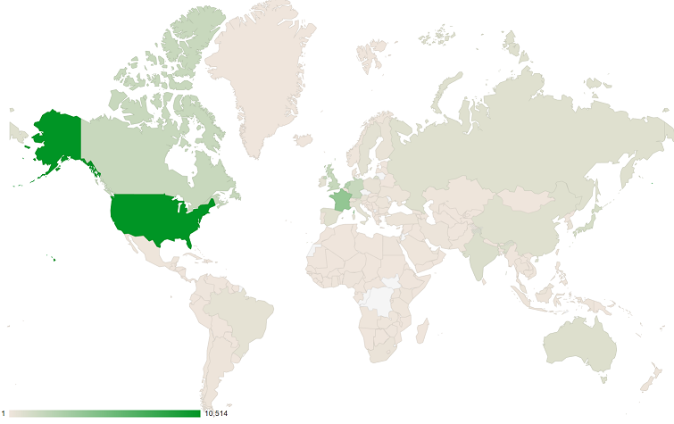

# Blocklist Blacklist

## Introduction
I was curious to see how often IPs from a given country are blocked due to being malicious. Maliciousness can be definine by a variety of parameters:
1. Fraud
2. Botnets
3. Advertising
4. Black market sales
5. Individual penetration
6. Government-sponsored infiltration

To achieve a visualization of blocked IPs by country, I looked to find a dataset from which a connection between the two could be drawn. Upon processing this dataset, I could then present a heatmap of each country based upon how often it's represented.

## Project Organization
I separated the project into a front-end and a back-end. The front-end (under `client`) was to display a map of the entire world along with points for each country that includes the location of a blocked IP address. The back-end (under `server`) was to parse and paginate the dataset.

## Dataset
The first step was to get a list of blocked IP addresses coupled with their country of origin. Using the [dataset found here](https://dev.maxmind.com/geoip/geoip2/geolite2/#Downloads) (under `GeoLite2 Country`), I received a zipped set of blocked IPs and country mappings for various major languages. I extracted and renamed the block list for more than 320,000 IPs and the English-language country mapping file  into the top-level of this project. The raw forms of each of these extractions may be seen in the files titled "GeoLit2-Country-Blocks-IPv4.csv" and "GeoLite2-Country-Locations-en.csv", respectively.

I further processed the block list by collecting only the first 50,000 blocked IPs. Should the need for a more expansive dataset arise, it would be trivial to add from the full list of 320,000. The results of this processing can be found in the server resource file titled "ipv4-block.csv". In this same resource folder, I've also included a separate copy of the country mappings file, here renamed "locations.csv".

## Back-End
I built the back-end using **Spring Boot** with extensions for **Spring Web**, **Spring Data JPA**, and **Spring Batch**.

To install the dependencies for this application, run the following from the `./server/` directory:
```
gradlew build
```

To run this application, run the following from the `./server/` directory:
```
gradlew bootRun
```
>**Note**: The server must be running first for the client to be populated with data. I suggest having two terminals open and running each on a different terminal. Split-screen or multi-tab terminals will also work.

The first step to get the back-end running was to fill a database with our blocked IP data. I decided to use **H2**, an in-memory Java database that interfaces nicely with the Spring framework. Upon starting the **Spring Boot** application, a **Spring Batch** job is automatically started. This job has two steps that are completed in sequence:

1. Load the in-memory database with a set of countries.
2. Load the in-memory database with a set of blocked IP addresses with a link to the country from which the IP connected.

>**Note**: Because the dataset is not particularly large, a full refresh into an in-memory database upon application start is not too strenuous on the machine. Should the dataset ever increase in size, though, a persistent data storage solution that only receives new countries or IPs would be preferrable.

Once the batch job completes, **Spring Web** kicks in to expose a single endpoint:
```
GET localhost:8080/ips

Response:
[
    {
        "id": 1,
        "network": "1.0.0.0/24",
        "country": {
            "continent_name": "Oceania",
            "country_name": "Australia"
        }
    },
    {
        "id": 2,
        "network": "1.0.1.0/24",
        "country": {
            "continent_name": "Asia",
            "country_name": "China"
        }
    },
    {
        "id": 3,
        "network": "1.0.2.0/23",
        "country": {
            "continent_name": "Asia",
            "country_name": "China"
        }
    },
    ...
}
```

The above JSON response returns all 50,000 IP addresses as well as the continent and country from where the IP was located. The final response body is just over 5 MB, so I felt it reasonable to add size limits and pagination. These query parameters (`start` and `size`) may be used in the following manner:
```
GET localhost:8080/ips?start=40&size=3

Response:
[
    {
        "id": 40,
        "network": "1.8.0.0/16",
        "country": {
            "continent_name": "Asia",
            "country_name": "China"
        }
    },
    {
        "id": 41,
        "network": "1.9.0.0/16",
        "country": {
            "continent_name": "Asia",
            "country_name": "Malaysia"
        }
    },
    {
        "id": 42,
        "network": "1.10.0.0/21",
        "country": {
            "continent_name": "Asia",
            "country_name": "China"
        }
    }
}
```
>**Note**: `start` is inclusive, meaning the ID passed into the parameter is the first in the response list. Also note that counting starts at 1 here.

With this data exposed, we now have a list that can be used on the front-end.

## Front-End
I built the front-end using **React**. To quickly get the project started, I used the Node package `create-react-app`.

To install the dependencies for this application, run the following from the `./client/` directory:
```
npm install
```

To run this application, run the following from the `./client/` directory:
```
npm start
```
>**Note**: The server must be running first for the client to be populated with data. I suggest having two terminals open and running each on a different terminal. Split-screen or multi-tab terminals will also work.

I intended this project to have a fairly simple front-end, so I kept the number of React components to a minimum. To further expand the scope of this project in the future, I would want to break the map and table components to their own files.

Once the initial state of the page is loaded with an empty table, the back-end is hit with a request for the first 10,000 IPs. To speed up the initial load, I chose to chain promises together with frequent updates to the component's state. Each time a page of IPs resolves, the state is updated. At this same time, another request is sent to the server. This allows the page to be browsable while large amounts of data load in the background.

Once some data is loaded, it is sent to the **Google Maps API** to form an embedded world map heatmap. The darker the color, the more prominently the country is featured in the set of blocked IPs. I've also provided a table to the right of the map that shows the top 20 countries with a frequency count of how often they have appeared in the data.

To sort and manipulate this data, I've added four buttons. Two buttons allow the data set to change between viewing blocked countries versus blocked continents. The other two buttons allow the table's sort order to flip between ascending and descending.